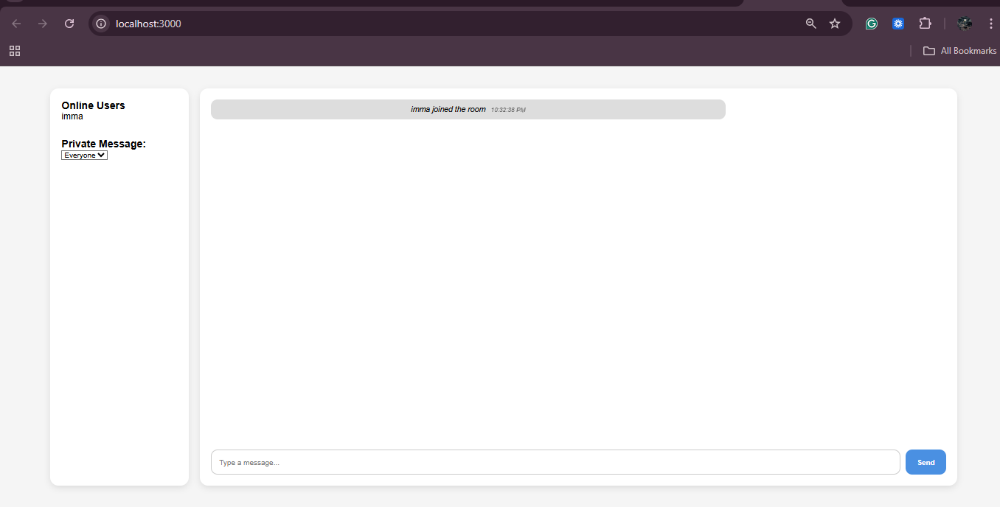
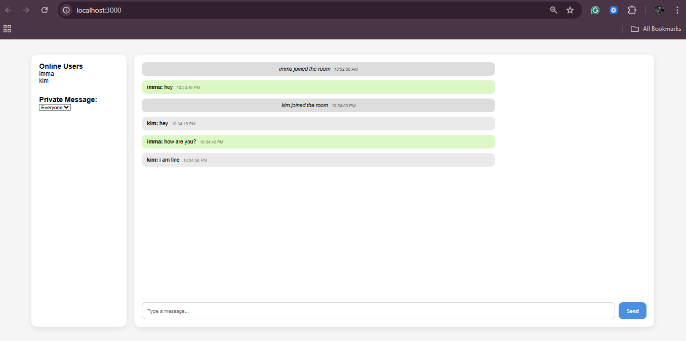

# Real-time Chat with Socket.io

A simple real-time chat application built with Node.js, Express and Socket.io for the server and React for the client. This project demonstrates real-time messaging, user presence, typing indicators and private messaging using WebSockets.

## Table of Contents

- [Project Overview](#project-overview)
- [Features Implemented](#features-implemented)
- [Screenshots & Demo](#screenshots--demo)
- [Deployed URLs](#deployed-urls)
- [Setup & Run (Development)](#setup--run-development)
- [Build & Deploy](#build--deploy)

## Project Overview

This repository contains a Socket.io powered chat application with a Node/Express backend and a React frontend. The backend manages socket connections, user lists, rooms, broadcasting messages, private messages and typing indicators. The frontend connects via `socket.io-client`, provides a login screen, and a chat interface showing messages and active users.
Project structure (top-level):

- `server.js` - Express + Socket.io server
- `client/` - React application (create-react-app)
- `assets/` - images/screenshots (place demo images here)
## Features Implemented

- Real-time messaging with Socket.io
- User join/leave and presence list (per room)
- Typing indicators
- Private messaging
- Auto-scroll to newest message (hook in `client/src/hooks`)
- New-message sound notification utility (`client/src/utils/sound.js`)
- Simple login screen to choose username and room

## Screenshots & Demo





## Deployed URLs (To be updated)

- Client (frontend): https://your-client-url.example.com
- Server (API / Socket server): https://your-server-url.example.com

Notes:
- The client currently connects to `http://localhost:5000` by default (see `client/src/socket/socket.js`). Update that URL to your server's deployed URL before building the client for production.
## Setup & Run (Development)

Prerequisites:

- Node.js (>= 14) and npm

1) Clone the repository

```powershell
git clone <REPO_URL>
cd real-time-communication-with-socket-io-KimaniImmaculate
```

2) Install root dependencies (for server)

```powershell
npm install
```

3) Start the server (in one terminal)

```powershell
npm run dev
# or: npm start
```

4) Start the client (in a second terminal)

```powershell
cd client
npm install
npm start
```

The client runs on `http://localhost:3000` and the server listens on port `5000` by default. The client is configured to connect to `http://localhost:5000` (see `client/src/socket/socket.js`).
## Build & Deploy

To build the client for production from the repository root:

```powershell
npm run build
```

This script will `cd` into the `client/`, install dependencies and run the React build. Note: the server in `server.js` currently does not serve the `client/build` folder by default. If you want to serve the client from the same Express server, you can add static serving in `server.js`:

```javascript
// after your other app.use() calls
app.use(express.static(path.join(__dirname, 'client', 'build')));
app.get('*', (req, res) => {
	res.sendFile(path.join(__dirname, 'client', 'build', 'index.html'));
});
```

Or host the client separately (Netlify, Vercel, GitHub Pages) and the server on a platform that supports WebSockets (Render, Fly, Heroku alternatives).


